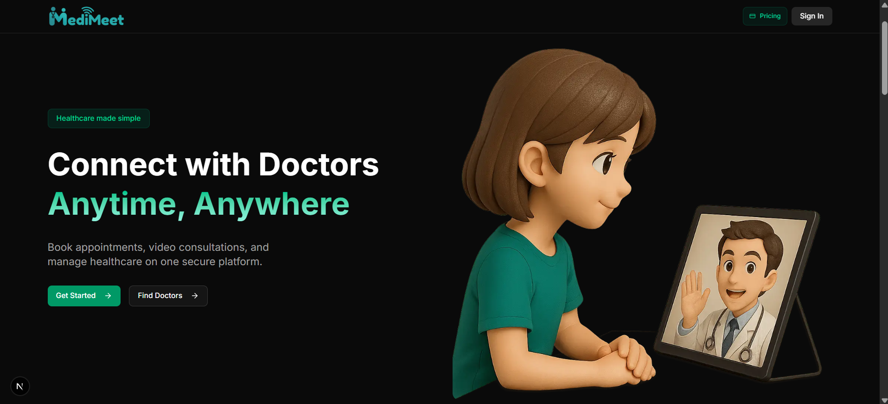

  <h1 align="center" id="top">MediMeet</h1>
  

    <b>Full-Stack Doctor Appointment & Telemedicine Platform</b> 
    Authentication • Payments • Video Calls • Doctor Management
  

  
  
  
  
  

---

## 📚 Table of Contents

1. [Overview](#overview)
2. [Tech Stack](#tech-stack)
3. [Features](#features)
4. [Screenshots](#screenshots)

---

## 🩺 Overview 

MediMeet is a **production-grade telemedicine solution** that enables patients to book appointments with certified doctors, attend **real-time video consultations**, and manage health records — all in one platform.  
Doctors can onboard, define their availability, manage bookings, and receive payments through integrated subscription plans.  
The platform comes with **role-based authentication**, an **admin dashboard**, and **scalable backend architecture** ready for deployment.

---

## ⚙️ Tech Stack 

- **Frontend:** Next.js 15, Shadcn UI, Tailwind CSS
- **Backend:** Next.js API Routes, PostgreSQL
- **Video Conferencing:** Vonage Video API
- **Payments:** Subscription + One-time
- **ORM:** Prisma with PostgreSQL
- **Authentication:** Clerk Auth
- **Hosting:** Vercel

---

## 🔋 Features 

**For Patients:**

- 🔑 Secure account creation & login
- 📅 Book, reschedule, and cancel appointments
- 📹 Join live video calls directly from the browser
- 💳 Pay for consultations

**For Doctors:**

- 📋 Guided onboarding process
- 🗓 Availability & schedule management
- 💼 Manage patient bookings in real time
- 📈 View analytics on consultations & revenue

**For Admin:**

- 👥 Manage doctors & patient accounts
- 🛡 Approve or reject doctor onboarding
- 🗂 Access system-wide analytics & revenue tracking

**Platform-Wide:**

- Responsive UI with Shadcn components
- Role-based routing & API protection
- Prisma-powered relational database models
- Full application deployed

---

## 📸 Screenshots 

---
